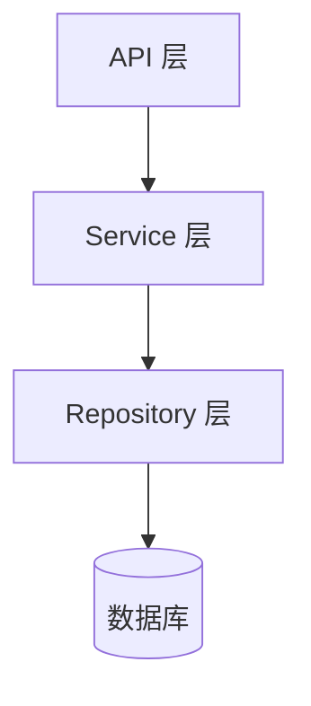
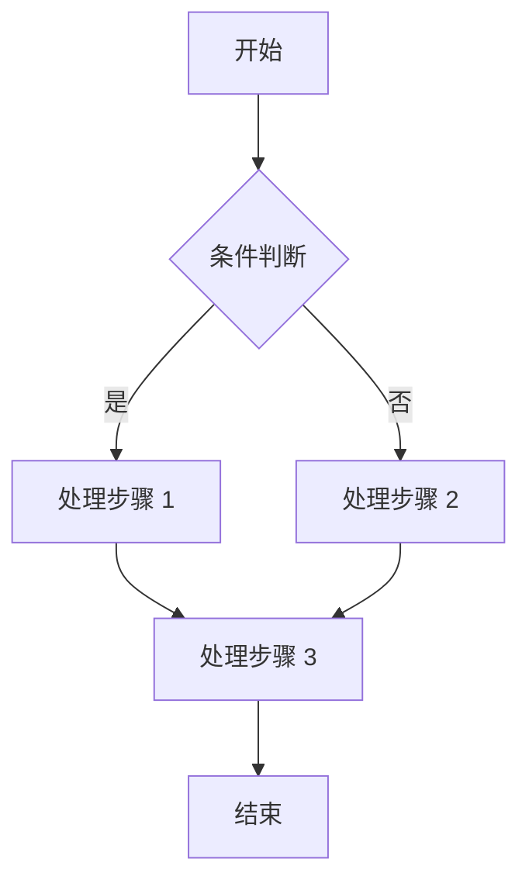
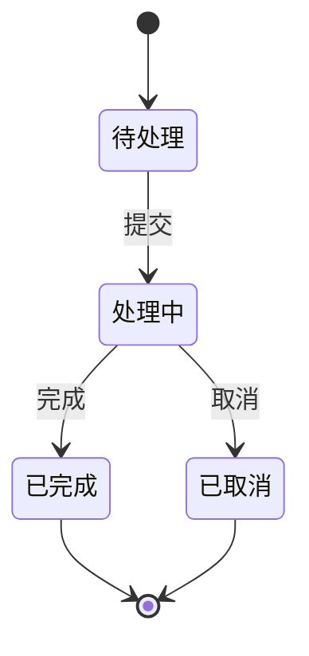

# {{功能名}} — 后端技术方案

> **文档版本**：1.0
> **创建日期**：{{YYYY-MM-DD}}
> **最后更新**：{{YYYY-MM-DD}}
> **需求来源**：`specs/features/{{功能名}}.md`
> **关联设计**：系统架构设计（3-project-system-architecture）

---

## 1. 设计概要

### 1.1 功能描述

<!-- 用 2-3 句话概括本功能要解决什么问题、实现什么能力 -->

### 1.2 影响范围

<!-- 列出本功能涉及的模块、服务、数据库、外部系统 -->

| 影响域 | 具体内容 | 变更类型 |
|--------|---------|---------|
| 数据库 | {{表名}} | 新增表 / 修改表 |
| 服务层 | {{模块名}} | 新增模块 / 修改模块 |
| API 层 | {{端点列表}} | 新增接口 / 修改接口 |
| 外部依赖 | {{第三方服务}} | 新增依赖 |
| 中间件 | {{中间件名称}} | 新增 / 修改 |

### 1.3 技术难点

<!-- 列出实现本功能的主要技术挑战和应对思路 -->

1. {{难点 1}}：{{应对方案}}
2. {{难点 2}}：{{应对方案}}

### 1.4 外部依赖

<!-- 列出本功能依赖的外部系统或服务 -->

| 依赖项 | 用途 | 降级方案 |
|--------|------|---------|
| {{依赖名称}} | {{用途说明}} | {{不可用时的处理方式}} |

---

## 2. 架构概览

> 根据功能复杂度选择合适的表达方式：
> - **简单功能**（单表 CRUD）：用文字描述分层即可
> - **中等功能**（多表关联、简单状态机）：用模块关系图
> - **复杂功能**（多服务协作、异步流程）：用 Mermaid 架构图

### 2.1 架构级别判定

- [ ] **L1 - 简单**：单表 CRUD，无复杂业务逻辑
- [ ] **L2 - 中等**：多表关联，有状态流转或简单计算
- [ ] **L3 - 复杂**：涉及多服务协作、异步处理、分布式事务

### 2.2 架构图 / 模块关系

<!-- L2 及以上必须提供架构图，使用 Mermaid 语法 -->



### 2.3 分层说明

<!-- 说明各层的职责和关键类 -->

| 层级 | 类/模块 | 职责 |
|------|--------|------|
| Controller | {{类名}} | 接收请求、参数校验、调用 Service |
| Service | {{类名}} | 核心业务逻辑 |
| Repository | {{类名}} | 数据访问 |

---

## 3. 数据库设计

> 从 AC 反推数据需求，明确每条 AC 涉及哪些实体和字段。
> 所有表和字段变更都必须标注服务于哪些 AC。

### 3.1 新增表

#### 3.1.1 {{表名}}

<!-- 表的用途说明 → {{功能缩写}}-AC-{{序号}} -->

| 字段名 | 类型 | 约束 | 说明 | AC 关联 |
|--------|------|------|------|---------|
| id | BIGINT | PK{{如：, AUTO_INCREMENT / SERIAL / GENERATED ALWAYS AS IDENTITY}} | 主键 | - |
| {{字段名}} | {{类型}} | {{约束}} | {{说明}} | → {{功能缩写}}-AC-{{序号}} |
| created_at | TIMESTAMP | NOT NULL, DEFAULT CURRENT_TIMESTAMP | 创建时间 | - |
| updated_at | TIMESTAMP | NOT NULL, DEFAULT CURRENT_TIMESTAMP{{如： ON UPDATE CURRENT_TIMESTAMP / 需触发器}} | 更新时间 | - |

**SQL DDL**：

```sql
CREATE TABLE {{表名}} (
    id BIGINT AUTO_INCREMENT PRIMARY KEY,
    {{字段名}} {{类型}} {{约束}} COMMENT '{{说明}}',
    created_at TIMESTAMP NOT NULL DEFAULT CURRENT_TIMESTAMP,
    updated_at TIMESTAMP NOT NULL DEFAULT CURRENT_TIMESTAMP ON UPDATE CURRENT_TIMESTAMP,
    -- 索引定义
    INDEX idx_{{字段名}} ({{字段名}})
) ENGINE=InnoDB DEFAULT CHARSET=utf8mb4 COMMENT='{{表注释}}';
```

```sql
-- PostgreSQL 语法
CREATE TABLE {{表名}} (
    id BIGINT GENERATED ALWAYS AS IDENTITY PRIMARY KEY,
    {{字段名}} {{类型}} {{约束}},
    created_at TIMESTAMPTZ NOT NULL DEFAULT now(),
    updated_at TIMESTAMPTZ NOT NULL DEFAULT now()
);
COMMENT ON TABLE {{表名}} IS '{{表注释}}';
CREATE INDEX idx_{{字段名}} ON {{表名}} ({{字段名}});
```

### 3.2 修改表

#### 3.2.1 {{表名}}

<!-- 修改原因 → {{功能缩写}}-AC-{{序号}} -->

| 变更类型 | 字段名 | 变更内容 | AC 关联 |
|---------|--------|---------|---------|
| 新增字段 | {{字段名}} | {{类型}} {{约束}} | → {{功能缩写}}-AC-{{序号}} |
| 修改字段 | {{字段名}} | {{变更说明}} | → {{功能缩写}}-AC-{{序号}} |
| 新增索引 | idx_{{名称}} | {{索引字段}} | → {{功能缩写}}-AC-{{序号}} |

**SQL DDL**：

```sql
-- 新增字段
ALTER TABLE {{表名}} ADD COLUMN {{字段名}} {{类型}} {{约束}} COMMENT '{{说明}}';
-- 新增索引
ALTER TABLE {{表名}} ADD INDEX idx_{{名称}} ({{字段名}});
```

```sql
-- PostgreSQL 语法
ALTER TABLE {{表名}} ADD COLUMN {{字段名}} {{类型}} {{约束}};
CREATE INDEX idx_{{名称}} ON {{表名}} ({{字段名}});
```

### 3.3 索引策略

<!-- 说明索引设计思路，覆盖哪些查询场景 -->

| 索引名 | 表名 | 字段 | 类型 | 查询场景 | AC 关联 |
|--------|------|------|------|---------|---------|
| idx_{{名称}} | {{表名}} | {{字段}} | B-TREE / UNIQUE | {{场景说明}} | → {{功能缩写}}-AC-{{序号}} |

### 3.4 数据迁移

<!-- 如涉及数据迁移，说明迁移方案 -->

- [ ] 不需要数据迁移
- [ ] 需要数据迁移：{{迁移方案说明}}

---

## 4. API 设计

> 从 AC 反推接口需求，每个 API 必须定义完整的请求/响应格式和错误码。
> 标注每个接口服务于哪些 AC。

### 4.1 API 总览

| 方法 | 路径 | 说明 | 认证要求 | AC 关联 |
|------|------|------|---------|---------|
| POST | /api/v1/{{resource}} | 创建{{资源}} | 需要登录 | → {{功能缩写}}-AC-{{序号}} |
| GET | /api/v1/{{resource}}/{{id}} | 获取{{资源}}详情 | 需要登录 | → {{功能缩写}}-AC-{{序号}} |
| PUT | /api/v1/{{resource}}/{{id}} | 更新{{资源}} | 需要登录 | → {{功能缩写}}-AC-{{序号}} |
| DELETE | /api/v1/{{resource}}/{{id}} | 删除{{资源}} | 需要登录 | → {{功能缩写}}-AC-{{序号}} |

### 4.2 接口详细设计

#### 4.2.1 POST /api/v1/{{resource}}

<!-- 接口说明 → {{功能缩写}}-AC-{{序号}} -->

**请求参数**：

| 字段名 | 类型 | 必填 | 说明 | 校验规则 |
|--------|------|------|------|---------|
| {{字段名}} | {{类型}} | 是/否 | {{说明}} | {{校验规则}} |

**请求示例**：

```json
{
  "{{字段名}}": "{{值}}"
}
```

**成功响应**（200 OK）：

```json
{
  "code": 0,
  "message": "success",
  "data": {
    "id": 1,
    "{{字段名}}": "{{值}}"
  }
}
```

**异常响应**：

| HTTP 状态码 | 错误码 | 说明 | 触发条件 |
|------------|--------|------|---------|
| 400 | PARAM_INVALID | 参数校验失败 | {{字段}}为空或格式错误 |
| 401 | UNAUTHORIZED | 未认证 | 未携带 Token 或 Token 过期 |
| 403 | FORBIDDEN | 无权限 | 当前用户无权操作该资源 |
| 409 | CONFLICT | 资源冲突 | {{资源}}已存在 |
| 500 | INTERNAL_ERROR | 服务内部错误 | 未知异常 |

<!-- 重复以上结构定义每个 API 端点 -->

---

## 5. 核心逻辑

> 从 AC 三类场景（正常流程、边界条件、异常情况）反推核心逻辑。
> 复杂流程必须使用 Mermaid 图表达。

### 5.1 {{逻辑模块名称}}

<!-- 该逻辑模块服务于 → {{功能缩写}}-AC-{{序号}} -->

#### 5.1.1 正常流程



#### 5.1.2 伪代码

<!-- 填写指引：请使用项目技术栈对应的语言编写伪代码，或使用上述语言无关风格 -->

```text
# {{逻辑模块名称}} - 核心处理逻辑 → {{功能缩写}}-AC-{{序号}}
FUNCTION handle_{{功能名}}(params):
    # Step 1: 参数校验
    validate(params)

    # Step 2: 业务校验
    check_business_rules(params)

    # Step 3: 数据处理
    result = process_data(params)

    # Step 4: 持久化
    save_to_db(result)

    RETURN result
```

#### 5.1.3 边界条件

| 场景 | 处理方式 | AC 关联 |
|------|---------|---------|
| {{边界场景 1}} | {{处理方式}} | → {{功能缩写}}-AC-{{序号}} |
| {{边界场景 2}} | {{处理方式}} | → {{功能缩写}}-AC-{{序号}} |

#### 5.1.4 异常处理

| 异常场景 | 异常类型 | 处理策略 | AC 关联 |
|---------|---------|---------|---------|
| {{异常场景 1}} | {{异常类型}} | {{重试/降级/报错}} | → {{功能缩写}}-AC-{{序号}} |
| {{异常场景 2}} | {{异常类型}} | {{重试/降级/报错}} | → {{功能缩写}}-AC-{{序号}} |

### 5.2 状态流转

<!-- 如涉及状态机，使用 Mermaid 状态图 -->



---

## 6. 现有代码改动

> 明确列出需要在现有代码中修改或新增的文件，确保融入而非另起一套。

### 6.1 新增文件

<!-- 填写指引：文件扩展名根据技术栈选择（.ts / .go / .py / .java），目录结构根据 specs/项目结构.md 调整 -->

| 文件路径 | 类型 | 说明 | AC 关联 |
|---------|------|------|---------|
| src/modules/{{模块}}/controller/{{控制器}}.{{ext}} | Controller | {{说明}} | → {{功能缩写}}-AC-{{序号}} |
| src/modules/{{模块}}/service/{{服务}}.{{ext}} | Service | {{说明}} | → {{功能缩写}}-AC-{{序号}} |
| src/modules/{{模块}}/repository/{{仓储}}.{{ext}} | Repository | {{说明}} | → {{功能缩写}}-AC-{{序号}} |
| src/modules/{{模块}}/dto/{{DTO}}.{{ext}} | DTO | {{说明}} | → {{功能缩写}}-AC-{{序号}} |

### 6.2 修改文件

| 文件路径 | 修改内容 | AC 关联 |
|---------|---------|---------|
| {{文件路径}} | {{修改说明}} | → {{功能缩写}}-AC-{{序号}} |

### 6.3 配置变更

| 配置项 | 文件路径 | 变更内容 | AC 关联 |
|--------|---------|---------|---------|
| {{配置项}} | {{文件路径}} | {{变更说明}} | → {{功能缩写}}-AC-{{序号}} |

---

## 7. 缓存 / 队列设计

> 仅当功能涉及缓存或异步队列时填写本章节。
> 如果不涉及，填写"本功能不涉及缓存和队列设计"即可。

### 7.1 缓存设计

<!-- 如涉及缓存，说明缓存策略 -->

| 缓存 Key | 数据内容 | 过期时间 | 更新策略 | AC 关联 |
|---------|---------|---------|---------|---------|
| {{key 模式}} | {{数据说明}} | {{TTL}} | {{主动更新/被动过期}} | → {{功能缩写}}-AC-{{序号}} |

### 7.2 消息队列设计

<!-- 如涉及消息队列，说明队列和消费者 -->

| 队列名 | 消息体 | 生产者 | 消费者 | 重试策略 | AC 关联 |
|--------|--------|--------|--------|---------|---------|
| {{队列名}} | {{消息结构}} | {{生产模块}} | {{消费模块}} | {{重试次数/间隔}} | → {{功能缩写}}-AC-{{序号}} |

---

## 8. 技术决策

> 只记录**真正纠结过的选择**，不记录显而易见的决策。
> 每个决策说明"选了什么"和"为什么选"。

| 决策点 | 可选方案 | 最终选择 | 选择理由 | AC 关联 |
|--------|---------|---------|---------|---------|
| {{决策点}} | {{方案 A / 方案 B}} | {{最终选择}} | {{理由}} | → {{功能缩写}}-AC-{{序号}} |

---

## 9. 安全与性能

> 按需填写。如果功能有特殊的安全或性能要求，在此说明。
> 如果没有特殊要求，填写"本功能无特殊安全与性能要求"即可。

### 9.1 安全设计

| 安全项 | 措施 | AC 关联 |
|--------|------|---------|
| {{认证/授权/加密/防刷}} | {{具体措施}} | → {{功能缩写}}-AC-{{序号}} |

### 9.2 性能设计

| 性能项 | 指标 | 保障措施 | AC 关联 |
|--------|------|---------|---------|
| {{响应时间/吞吐量/并发}} | {{目标值}} | {{具体措施}} | → {{功能缩写}}-AC-{{序号}} |

---

## 10. AC 覆盖总表

> **核心检查清单**：逐条确认每条 AC 都有对应的技术实现。
> 如果某条 AC 标记为"未覆盖"，则方案不合格。

| AC 编号 | AC 描述 | 覆盖章节 | 覆盖状态 |
|---------|---------|---------|---------|
| {{功能缩写}}-AC-001 | {{AC 描述}} | {{章节引用}} | [x] 已覆盖 |
| {{功能缩写}}-AC-002 | {{AC 描述}} | {{章节引用}} | [x] 已覆盖 |
| {{功能缩写}}-AC-003 | {{AC 描述}} | {{章节引用}} | [x] 已覆盖 |

---

## 11. 变更记录

| 日期 | 版本 | 变更内容 | 作者 |
|------|------|---------|------|
| {{YYYY-MM-DD}} | 1.0 | 初始版本 | {{作者}} |

---

## 12. 设计偏差记录

> 如果在编写技术方案过程中发现上游设计文档不支持当前功能需求，在此记录偏差。

| # | 上游文档 | 偏差描述 | 修正建议 | 状态 |
|---|---------|---------|---------|------|
| <!-- 如无偏差，填写"无" --> | | | | |

## 13. 约束豁免记录

> 如果当前功能的技术需求与项目级全局约束存在冲突，在此记录豁免。

| # | 约束名称 | 豁免原因 | 替代方案 | 用户确认 |
|---|---------|---------|---------|---------|
| <!-- 如无豁免，填写"无" --> | | | | |
