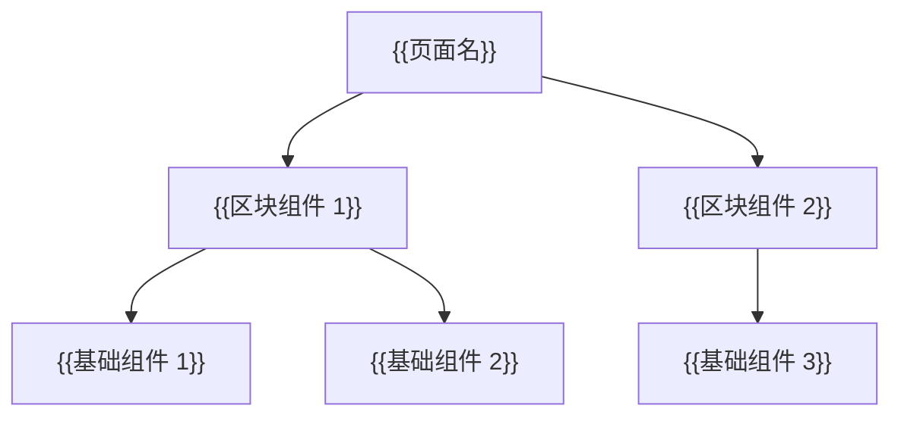
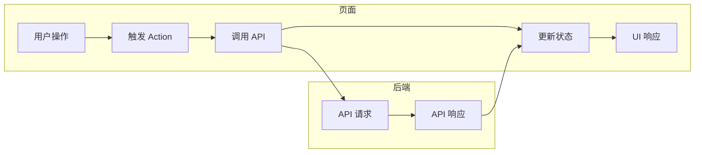
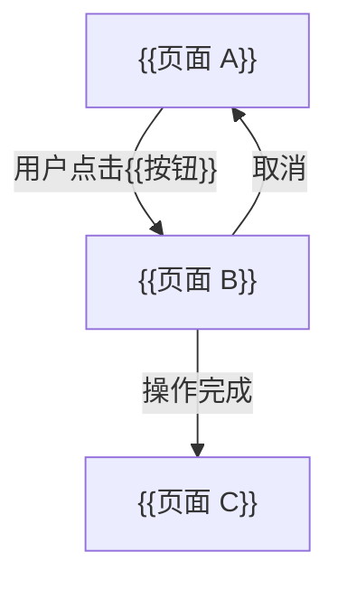
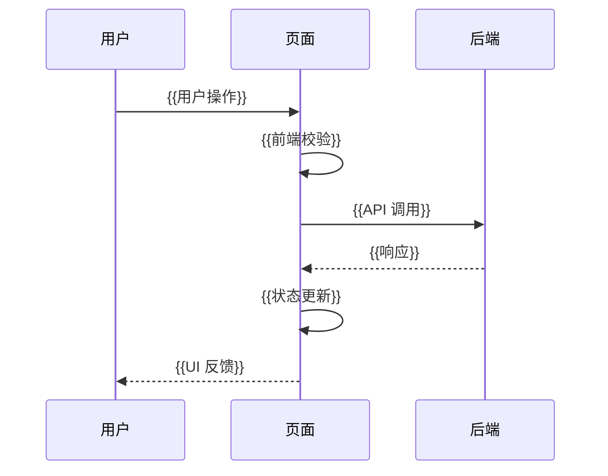

# {{功能名}} — 前端技术方案

> **文档版本**：1.0
> **创建日期**：{{YYYY-MM-DD}}
> **最后更新**：{{YYYY-MM-DD}}
> **需求来源**：`specs/features/{{功能名}}.md`
> **后端方案**：`specs/features/{{功能名}}_后端技术方案.md`
> **设计规范**：`specs/设计规范.md`

---

## 1. 设计概要

### 1.1 功能描述

<!-- 用 2-3 句话概括本功能在前端要实现什么交互、展示什么内容 -->

### 1.2 影响范围

<!-- 列出本功能涉及的前端模块、页面、组件、路由等 -->

| 影响域 | 具体内容 | 变更类型 |
|--------|---------|---------|
| 页面 | {{页面名}} | 新增页面 / 修改页面 |
| 组件 | {{组件名}} | 新增组件 / 修改组件 |
| 路由 | {{路由路径}} | 新增路由 / 修改路由 |
| 状态管理 | {{Store名}} | 新增 Store / 修改 Store |
| Hooks | {{Hook名}} | 新增 Hook / 修改 Hook |
| 样式 | {{样式文件}} | 新增样式 / 修改样式 |

### 1.3 技术难点

<!-- 列出前端实现的主要技术挑战和应对思路 -->

1. {{难点 1}}：{{应对方案}}
2. {{难点 2}}：{{应对方案}}

### 1.4 外部依赖

<!-- 列出本功能需要新增的前端依赖（npm 包等） -->

| 依赖包 | 版本 | 用途 | 体积影响 |
|--------|------|------|---------|
| {{包名}} | {{版本}} | {{用途说明}} | {{gzip 大小}} |

---

## 2. 页面组件树

> 从 AC 反推页面结构和组件拆分。
> 按层级组织：页面级（Page）> 区块级（Section/Block）> 基础组件（UI Component）。
> 标注每个组件服务于哪些 AC。

### 2.1 页面列表

| 页面名称 | 路由路径 | 说明 | AC 关联 |
|---------|---------|------|---------|
| {{页面名}} | /{{path}} | {{页面说明}} | → {{功能缩写}}-AC-{{序号}} |

### 2.2 组件树



### 2.3 组件详细设计

#### 2.3.1 {{组件名}}

<!-- 组件用途说明 → {{功能缩写}}-AC-{{序号}} -->

| 属性 | 类型 | 必填 | 默认值 | 说明 |
|------|------|------|--------|------|
| {{propName}} | {{类型}} | 是/否 | {{默认值}} | {{说明}} |
| {{onCallback}} | () => void | 是/否 | - | {{回调说明}} |

**组件职责**：{{一句话描述该组件负责什么}}

**设计规范遵循**：

- 颜色：使用 Design Token `{{token-name}}` → {{功能缩写}}-AC-{{序号}}
- 字体：使用 Design Token `{{token-name}}`
- 间距：使用 Design Token `{{token-name}}`

<!-- 重复以上结构定义每个组件 -->

---

## 3. 数据流设计

> 从 AC 反推数据获取和状态变化。
> 明确每个页面/组件需要哪些数据、数据从哪个 API 获取、状态如何管理。

### 3.1 API 使用总览

<!-- 汇总本功能需要调用的后端 API，引用后端技术方案中的定义 -->

| API 端点 | 方法 | 使用场景 | 调用时机 | AC 关联 |
|---------|------|---------|---------|---------|
| /api/v1/{{resource}} | GET | 获取{{资源}}列表 | 页面加载时 | → {{功能缩写}}-AC-{{序号}} |
| /api/v1/{{resource}} | POST | 创建{{资源}} | 用户提交表单时 | → {{功能缩写}}-AC-{{序号}} |

### 3.2 数据流图



### 3.3 状态管理方案

<!-- 明确区分全局状态与页面本地状态的边界，定义全局 Store 的完整结构 -->

#### 3.3.1 状态边界定义

| 状态归属 | 判断标准 | 管理方式 | 示例 |
|---------|---------|---------|------|
| **全局状态** | 跨 2 个以上组件/页面共享 | 全局 Store（如 Zustand/Pinia） | 用户信息、主题设置、全局通知 |
| **页面本地状态** | 仅当前页面/组件使用 | useState / ref | 表单输入、弹窗开关、加载状态 |
| **服务端缓存** | 来自 API、需跨页面复用 | SWR / React Query / TanStack Query | 列表数据、详情数据 |

#### 3.3.2 全局 Store 定义

<!-- 每个全局 Store 必须定义完整的状态字段和 Action 方法 -->

**Store 名称**：`use{{StoreName}}Store`

| 状态字段 | 类型 | 初始值 | 说明 | AC 关联 |
|---------|------|--------|------|---------|
| {{fieldName}} | {{类型}} | {{初始值}} | {{字段说明}} | → {{功能缩写}}-AC-{{序号}} |

| Action 方法 | 参数 | 返回值 | 说明 | AC 关联 |
|------------|------|--------|------|---------|
| {{actionName}} | {{参数类型}} | {{返回类型}} | {{方法说明}} | → {{功能缩写}}-AC-{{序号}} |

#### 3.3.3 页面本地状态

| 状态名称 | 数据内容 | 管理方式 | 初始值 | AC 关联 |
|---------|---------|---------|--------|---------|
| {{状态名}} | {{数据说明}} | useState / useStore / SWR | {{初始值}} | → {{功能缩写}}-AC-{{序号}} |

### 3.4 数据获取策略

| 数据 | 获取方式 | 缓存策略 | 重新验证条件 | AC 关联 |
|------|---------|---------|------------|---------|
| {{数据名}} | {{数据获取方案}} | {{缓存时间}} | {{触发条件}} | → {{功能缩写}}-AC-{{序号}} |

<!-- 填写指引：根据技术栈选择对应的数据获取方案，如 SWR / React Query / 手动 fetch / VueUse useFetch / 其他 -->

### 3.5 乐观更新

<!-- 如涉及乐观更新，说明更新和回滚策略 -->

| 操作 | 乐观更新内容 | 回滚条件 | AC 关联 |
|------|------------|---------|---------|
| {{操作名}} | {{立即更新的 UI 状态}} | {{API 失败时回滚}} | → {{功能缩写}}-AC-{{序号}} |

---

## 4. 路由设计

> 从 AC 反推页面流转，定义本功能新增的路由。

### 4.1 路由表

| 路由路径 | 页面组件 | 参数（类型/校验） | 权限要求 | 懒加载 | 嵌套布局 | AC 关联 |
|---------|---------|-----------------|---------|--------|---------|---------|
| /{{path}} | {{PageComponent}} | 无 | {{登录/角色}} | 是/否 | {{LayoutComponent 或"无"}} | → {{功能缩写}}-AC-{{序号}} |
| /{{path}}/:id | {{PageComponent}} | id: string（UUID 格式校验） | {{登录/角色}} | 是/否 | {{LayoutComponent 或"无"}} | → {{功能缩写}}-AC-{{序号}} |

### 4.2 页面流转图



### 4.3 路由守卫

<!-- 说明哪些路由需要守卫，以及守卫逻辑 -->

| 路由 | 守卫类型 | 守卫逻辑 | 未通过时跳转 | AC 关联 |
|------|---------|---------|------------|---------|
| /{{path}} | 登录守卫 | 检查 Token 是否有效 | /login | → {{功能缩写}}-AC-{{序号}} |
| /{{path}} | 权限守卫 | 检查用户角色 | /403 | → {{功能缩写}}-AC-{{序号}} |

---

## 5. 核心交互逻辑

> 描述关键交互的实现思路，包含伪代码。
> 复杂交互流程必须使用 Mermaid 图表达。

### 5.1 {{交互名}}

<!-- 交互说明 → {{功能缩写}}-AC-{{序号}} -->

#### 5.1.1 交互流程



#### 5.1.2 伪代码

```typescript
// {{交互名}} - 核心逻辑 → {{功能缩写}}-AC-{{序号}}
async function handle{{交互名}}() {
  // Step 1: 前端校验
  const isValid = validateForm(formData);
  if (!isValid) return;

  // Step 2: 设置加载状态
  setLoading(true);

  // Step 3: 调用 API
  try {
    const result = await api.post('/api/v1/{{resource}}', formData);

    // Step 4: 更新状态
    setData(prev => [...prev, result.data]);

    // Step 5: 用户反馈
    showToast('操作成功');
  } catch (error) {
    // Step 6: 错误处理
    showErrorToast(error.message);
  } finally {
    setLoading(false);
  }
}
```

#### 5.1.3 表单校验规则

<!-- 从 AC 中的输入约束反推校验规则 -->

| 字段 | 校验规则 | 错误提示 | AC 关联 |
|------|---------|---------|---------|
| {{字段名}} | {{必填/格式/范围}} | {{提示文案}} | → {{功能缩写}}-AC-{{序号}} |

<!-- 重复以上结构定义每个核心交互 -->

---

## 6. 现有代码改动

> 明确列出需要在现有代码中修改或新增的文件，确保融入而非另起一套。

### 6.1 新增文件

| 文件路径 | 类型 | 说明 | AC 关联 |
|---------|------|------|---------|
| src/app/{{页面名}}/page.tsx | Page | {{页面说明}} | → {{功能缩写}}-AC-{{序号}} |
| src/components/{{组件名}}/index.tsx | Component | {{组件说明}} | → {{功能缩写}}-AC-{{序号}} |
| src/components/{{组件名}}/styles.module.css | Style | {{样式说明}} | → {{功能缩写}}-AC-{{序号}} |
| src/hooks/use{{Hook名}}.ts | Hook | {{Hook 说明}} | → {{功能缩写}}-AC-{{序号}} |
| src/stores/{{Store名}}.ts | Store | {{状态管理说明}} | → {{功能缩写}}-AC-{{序号}} |
| src/app/api/{{模块名}}/route.ts | API Route | {{API 路由封装说明}} | → {{功能缩写}}-AC-{{序号}} |
| src/types/{{类型名}}.ts | Type | {{类型定义说明}} | → {{功能缩写}}-AC-{{序号}} |

### 6.2 修改文件

| 文件路径 | 修改内容 | AC 关联 |
|---------|---------|---------|
| {{文件路径}} | {{修改说明}} | → {{功能缩写}}-AC-{{序号}} |

### 6.3 配置变更

| 配置项 | 文件路径 | 变更内容 | AC 关联 |
|--------|---------|---------|---------|
| {{配置项}} | {{文件路径}} | {{变更说明}} | → {{功能缩写}}-AC-{{序号}} |

---

## 7. 性能优化

> 仅当功能有特殊性能需求时填写本章节。
> 如果没有特殊性能要求，填写"本功能无特殊性能优化需求"即可。

### 7.1 懒加载

| 加载目标 | 加载方式 | 触发条件 | AC 关联 |
|---------|---------|---------|---------|
| {{页面/组件}} | React.lazy / dynamic import | 路由进入时 | → {{功能缩写}}-AC-{{序号}} |

### 7.2 数据缓存

| 缓存目标 | 缓存方式 | 缓存时间 | 失效策略 | AC 关联 |
|---------|---------|---------|---------|---------|
| {{数据名}} | SWR / localStorage | {{时间}} | {{失效条件}} | → {{功能缩写}}-AC-{{序号}} |

### 7.3 渲染优化

| 优化项 | 优化方式 | 预期效果 | AC 关联 |
|--------|---------|---------|---------|
| {{列表渲染}} | 虚拟滚动 / 分页 | {{减少 DOM 节点数}} | → {{功能缩写}}-AC-{{序号}} |
| {{频繁更新}} | useMemo / useCallback / React.memo | {{减少重渲染}} | → {{功能缩写}}-AC-{{序号}} |

---

## 8. 技术决策

> 只记录**真正纠结过的选择**，不记录显而易见的决策。
> 每个决策说明"选了什么"和"为什么选"。

| 决策点 | 可选方案 | 最终选择 | 选择理由 | AC 关联 |
|--------|---------|---------|---------|---------|
| {{决策点}} | {{方案 A / 方案 B}} | {{最终选择}} | {{理由}} | → {{功能缩写}}-AC-{{序号}} |

---

## 9. 无障碍与响应式

> 按需填写。如果功能有特殊无障碍或响应式要求，在此说明。
> 如果没有特殊要求，填写"本功能无特殊无障碍与响应式要求"即可。

### 9.1 无障碍设计

| 无障碍项 | 措施 | WCAG 标准 | AC 关联 |
|---------|------|-----------|---------|
| {{键盘导航/屏幕阅读器/颜色对比}} | {{具体措施}} | {{标准编号}} | → {{功能缩写}}-AC-{{序号}} |

### 9.2 响应式设计

| 断点 | 布局变化 | 关键组件 | AC 关联 |
|------|---------|---------|---------|
| {{断点范围}} | {{布局说明}} | {{组件变化}} | → {{功能缩写}}-AC-{{序号}} |

---

## 10. AC 覆盖总表

> **核心检查清单**：逐条确认每条 AC 都有对应的技术实现。
> 如果某条 AC 标记为"未覆盖"，则方案不合格。

| AC 编号 | AC 描述 | 覆盖章节 | 覆盖状态 |
|---------|---------|---------|---------|
| {{功能缩写}}-AC-001 | {{AC 描述}} | {{章节引用}} | [x] 已覆盖 |
| {{功能缩写}}-AC-002 | {{AC 描述}} | {{章节引用}} | [x] 已覆盖 |
| {{功能缩写}}-AC-003 | {{AC 描述}} | {{章节引用}} | [x] 已覆盖 |

---

## 11. 变更记录

| 日期 | 版本 | 变更内容 | 作者 |
|------|------|---------|------|
| {{YYYY-MM-DD}} | 1.0 | 初始版本 | {{作者}} |

---

## 12. 设计偏差记录

> 如果在编写技术方案过程中发现上游设计文档不支持当前功能需求，在此记录偏差。

| # | 上游文档 | 偏差描述 | 修正建议 | 状态 |
|---|---------|---------|---------|------|
| <!-- 如无偏差，填写"无" --> | | | | |

## 13. 约束豁免记录

> 如果当前功能的技术需求与项目级全局约束存在冲突，在此记录豁免。

| # | 约束名称 | 豁免原因 | 替代方案 | 用户确认 |
|---|---------|---------|---------|---------|
| <!-- 如无豁免，填写"无" --> | | | | |
