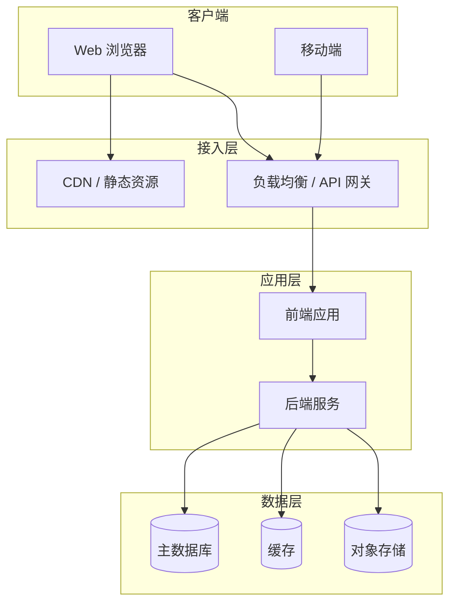
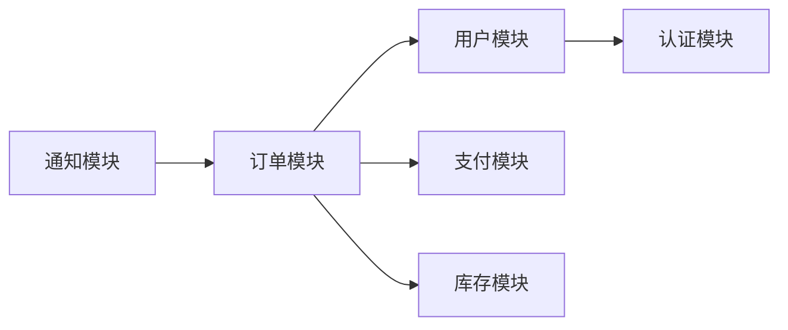

# 系统架构设计

> **文档版本**：1.0
> **创建日期**：{{YYYY-MM-DD}}
> **最后更新**：{{YYYY-MM-DD}}

## 1. 架构概述
*用一句话描述整体架构风格。*
<!-- 填写指引：基于 PRD 中的功能复杂度和技术栈文档中的选型决定，用一句话描述整体架构风格 -->

> {{在此处生成，例如：基于 Next.js 全栈的单体应用架构，采用 BFF 层统一前后端通信}}

## 2. 整体架构图
*展示服务划分、通信协议和部署拓扑。*



> {{根据实际项目调整架构图，标注通信协议（HTTP / WebSocket / gRPC 等）}}

## 3. 高可用方案

<!-- 简单项目（单机部署、无高并发需求）可删除此节，在概述中说明"暂不需要"即可 -->

<!-- 填写指引：根据 PRD 中的可用性约束和预期用户量级，设计负载均衡和容灾策略 -->

### 3.1 负载均衡策略
*   **策略**：{{例如：Nginx 反向代理 / 云厂商 LB}}
*   **算法**：{{例如：轮询 / 最少连接 / 加权轮询}}
*   **健康检查**：{{例如：每 10s 检查一次，连续 3 次失败则摘除}}

### 3.2 容灾策略
*   **数据备份**：{{例如：每日全量备份 + 实时增量备份}}
*   **多可用区**：{{例如：主备部署 / 多活部署 / 单机部署（小项目）}}
*   **RTO / RPO**：{{例如：RTO < 1h, RPO < 5min}}

### 3.3 降级方案
*   **核心链路保护**：{{例如：订单服务不可降级，推荐服务可降级}}
*   **熔断策略**：{{例如：错误率 > 50% 时触发熔断，30s 后半开探测}}
*   **限流策略**：{{例如：单用户 100 次/分钟，全局限流 10000 次/分钟}}

## 4. 安全架构

<!-- 填写指引：根据 PRD 中的安全约束，设计认证、授权和数据加密方案 -->

### 4.1 认证方案
*   **方案**：{{例如：JWT / OAuth2 / Session}}
*   **Token 有效期**：{{例如：Access Token 15min, Refresh Token 7d}}
*   **多端登录策略**：{{例如：允许 / 互踢 / 并发}}

### 4.2 授权模型
*   **模型**：{{例如：RBAC（基于角色）/ ABAC（基于属性）}}
*   **权限粒度**：{{例如：页面级 / 按钮级 / 数据行级}}
*   **角色定义**：{{列出核心角色}}

### 4.3 数据加密策略
*   **传输加密**：{{例如：HTTPS (TLS 1.3)}}
*   **存储加密**：{{例如：敏感字段 AES-256 加密存储}}
*   **密钥管理**：{{例如：环境变量 / 密钥管理服务}}

### 4.4 CORS 配置
*   **允许的源**：{{例如：开发环境 localhost:3000, 生产环境 example.com}}
*   **允许的方法**：{{例如：GET, POST, PUT, DELETE}}
*   **允许的头部**：{{例如：Content-Type, Authorization}}
*   **凭证支持**：{{例如：允许 / 不允许}}

## 5. 服务间依赖关系
*展示模块间的调用关系和依赖方向。*



> {{根据实际项目绘制模块依赖图，标注依赖方向和通信方式}}

### 依赖关系说明
| 模块 | 依赖模块 | 通信方式 | 说明 |
|------|---------|---------|------|
| {{模块 A}} | {{模块 B}} | {{HTTP / gRPC / 事件}} | {{简要说明依赖原因}} |

## 6. 后端技术选型

<!-- 填写指引：基于 specs/技术栈.md 中的选型，细化后端的分层架构、缓存策略、消息队列等 -->

### 6.1 分层架构
*   **架构模式**：{{例如：经典三层（Controller / Service / Repository）/ 六边形架构 / 洋葱架构}}
*   **分层说明**：
    *   **Controller 层**：{{职责描述}}
    *   **Service 层**：{{职责描述}}
    *   **Repository 层**：{{职责描述}}

### 6.2 缓存策略
*   **缓存组件**：{{例如：Redis}}
*   **缓存粒度**：{{例如：页面级 / 接口级 / 数据行级}}
*   **缓存模式**：{{例如：Cache-Aside / Write-Through / Write-Behind}}
*   **失效策略**：{{例如：TTL + 主动失效}}
*   **防护措施**：
    *   缓存穿透：{{例如：布隆过滤器 / 空值缓存}}
    *   缓存击穿：{{例如：互斥锁 / 逻辑过期}}
    *   缓存雪崩：{{例如：随机 TTL / 多级缓存}}

### 6.3 消息队列

<!-- 简单项目（无异步处理需求）可删除此节，在概述中说明"暂不需要"即可 -->

*   **选型**：{{例如：RabbitMQ / Kafka / Redis Streams / 不使用}}
*   **使用场景**：
    *   {{场景 1}}：{{例如：订单创建后发送通知}}
    *   {{场景 2}}：{{例如：异步导出报表}}
*   **消息可靠性**：{{例如：生产者确认 + 消费者手动 ACK + 死信队列}}

### 6.4 并发处理

<!-- 简单项目（单机部署、无并发竞争场景）可删除此节，在概述中说明"暂不需要"即可 -->

*   **乐观锁**：{{适用场景，例如：库存扣减}}
*   **悲观锁**：{{适用场景，例如：账户余额操作}}
*   **分布式锁**：{{适用场景，例如：定时任务防重入}}
*   **幂等性设计**：{{适用场景，例如：支付回调}}

### 6.5 日志与错误处理

*   **日志框架**：<!-- 如：Winston / Pino -->
*   **日志级别**：<!-- ERROR / WARN / INFO / DEBUG -->
*   **错误码体系**：<!-- 如：HTTP 状态码 + 业务错误码 -->
*   **统一错误响应格式**：<!-- 定义标准错误响应结构 -->

## 7. 前端技术选型

<!-- 填写指引：基于 specs/技术栈.md 中的选型，细化前端的渲染策略、路由、状态管理等 -->

### 7.1 渲染策略
*   **策略选择**：{{例如：SSR（服务端渲染）/ CSR（客户端渲染）/ ISR（增量静态再生）/ 混合渲染}}
*   **选择理由**：{{例如：SSR 优化首屏加载和 SEO，CSR 用于交互密集的管理后台}}
*   **各页面渲染策略**：

| 页面/模块 | 渲染策略 | 理由 |
|----------|---------|------|
| {{首页}} | {{SSR}} | {{需要 SEO 和快速首屏}} |
| {{管理后台}} | {{CSR}} | {{无需 SEO，交互复杂}} |

### 7.2 路由设计
*   **路由方案**：{{例如：文件系统路由（Next.js）/ 配置式路由（Vue Router）}}
*   **路由守卫**：{{例如：登录校验、权限校验}}

<!-- 填写指引：具体路由路径以 specs/信息架构图.md 中的页面清单为准，此处仅定义路由技术方案（文件路由 vs 配置路由）。 -->

*   **路由结构**：

```text
/                    → 首页
/login               → 登录页
/dashboard           → 仪表盘
/dashboard/settings  → 设置页
```

### 7.3 状态管理
*   **方案**：{{例如：Zustand / Redux Toolkit / Pinia / Jotai}}
*   **分层策略**：
    *   **全局状态**：{{例如：用户信息、主题设置}}
    *   **服务端状态**：{{例如：TanStack Query / SWR}}
    *   **组件局部状态**：{{例如：useState / useReducer}}
*   **选择理由**：{{例如：Zustand 轻量无模板代码，TanStack Query 自动处理缓存和失效}}

### 7.4 组件拆分方案
*   **拆分原则**：{{例如：原子设计（Atom / Molecule / Organism）/ 按业务域拆分}}
*   **组件层级**：

| 层级 | 说明 | 示例 |
|------|------|------|
| {{基础组件}} | {{无业务逻辑的 UI 原子}} | {{Button / Input / Modal}} |
| {{业务组件}} | {{包含业务逻辑的组合}} | {{UserCard / OrderList}} |
| {{页面组件}} | {{路由级组件}} | {{DashboardPage}} |

### 7.5 数据流设计
*   **请求流程**：{{例如：组件 → API 层 → 后端 → 缓存 → 组件更新}}
*   **缓存策略**：{{例如：staleTime / gcTime 配置}}
*   **乐观更新**：{{适用场景，例如：点赞、收藏等即时反馈操作}}
*   **错误处理**：{{例如：全局错误边界 + 局部 toast 提示}}

### 7.6 性能优化策略
*   **代码分割**：{{例如：路由级懒加载 / 组件级动态导入}}
*   **资源优化**：{{例如：图片懒加载 / 字体预加载 / CDN 加速}}
*   **渲染优化**：{{例如：虚拟列表 / React.memo / useMemo}}
*   **构建优化**：{{例如：Tree Shaking / 压缩 / 分析 Bundle 体积}}

## 8. 技术约束总表
*所有功能级技术方案（10/11）必须遵循的约束清单。*

<!-- 填写指引：汇总所有功能级技术方案必须遵循的技术约束，确保后续 Skill 10/11 不违反 -->

| # | 约束项 | 约束内容 | 适用范围 |
|---|-------|---------|---------|
| 1 | {{例如：API 风格}} | {{所有 API 必须遵循 RESTful 规范}} | {{后端}} |
| 2 | {{例如：认证方式}} | {{统一使用 JWT 认证}} | {{前后端}} |
| 3 | {{例如：状态管理}} | {{服务端数据统一使用 TanStack Query 管理}} | {{前端}} |
| 4 | {{例如：数据库}} | {{所有表必须包含 id, created_at, updated_at 字段}} | {{后端}} |
| 5 | {{例如：错误处理}} | {{所有 API 错误必须返回统一的错误码格式}} | {{前后端}} |

## 9. 变更记录

| 日期 | 版本 | 变更内容 | 作者 |
|------|------|---------|------|
| {{YYYY-MM-DD}} | 1.0 | 初始版本 | {{作者}} |
