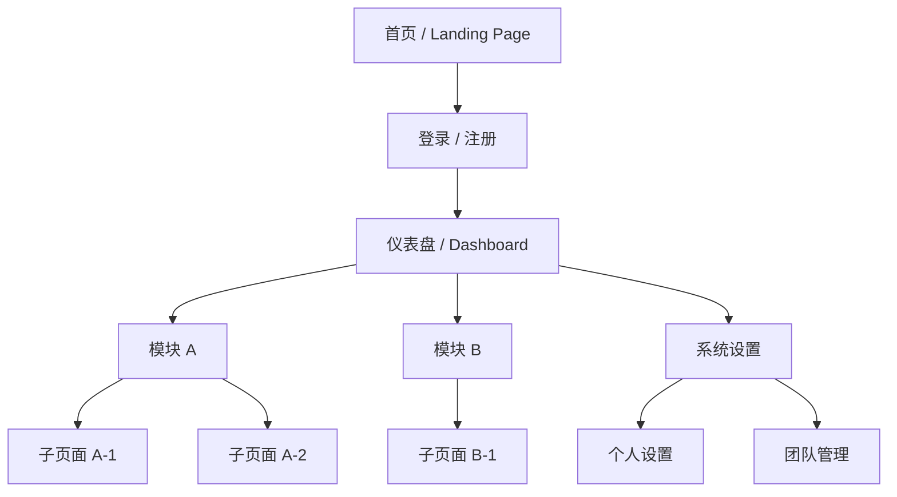

# 信息架构图

> **文档版本**：1.0
> **创建日期**：{{YYYY-MM-DD}}
> **最后更新**：{{YYYY-MM-DD}}

## 1. 信息架构概述
*用一段话描述整体信息架构的设计思路。*
> {{在此处生成，例如：本系统采用"核心 + 扩展"的信息架构，以仪表盘为核心入口，按业务域划分功能模块，支持多角色差异化访问。}}

## 2. 站点地图
*展示页面层级和导航结构。*

> {{根据实际项目调整站点地图，标注各页面的访问角色}}

## 3. 页面清单表
*列出系统中的所有页面及其基本信息。*

| 序号 | 页面名称 | 路由路径 | 所属模块 | 访问角色 | 说明 |
|------|---------|---------|---------|---------|------|
| 1 | {{首页}} | {{/}} | {{公共}} | {{所有用户}} | {{产品介绍和引导}} |
| 2 | {{登录页}} | {{/login}} | {{认证}} | {{未登录用户}} | {{账号密码登录}} |
| 3 | {{注册页}} | {{/register}} | {{认证}} | {{未登录用户}} | {{新用户注册}} |
| 4 | {{仪表盘}} | {{/dashboard}} | {{核心}} | {{已登录用户}} | {{数据概览和快捷入口}} |
| 5 | {{设置页}} | {{/settings}} | {{系统}} | {{管理员}} | {{系统配置}} |

> {{根据实际项目补充完整页面清单，确保覆盖 PRD 中的所有功能}}

## 4. 内容分类体系
*定义信息的组织方式和分类标签。*

<!-- 如果分类结构简单（扁平标签），只需填写分类标签定义，无需定义多层级关系 -->

### 4.1 分类结构
*   **分类模式**：{{例如：树形分类 / 扁平标签 / 混合模式}}
*   **分类层级**：{{例如：一级分类 → 二级分类 → 三级分类}}

### 4.2 分类标签定义

| 分类名称 | 父级分类 | 说明 | 包含内容 |
|---------|---------|------|---------|
| {{分类 A}} | {{无 / 父分类名}} | {{分类说明}} | {{内容类型列表}} |
| {{分类 B}} | {{分类 A}} | {{分类说明}} | {{内容类型列表}} |

### 4.3 内容类型
*定义系统中存在的内容类型。*

| 内容类型 | 说明 | 所属模块 | 展示形式 |
|---------|------|---------|---------|
| {{文章}} | {{用户发布的图文内容}} | {{内容模块}} | {{列表 / 详情页}} |
| {{订单}} | {{用户的交易记录}} | {{交易模块}} | {{列表 / 详情页}} |

## 5. 角色与权限映射表
*定义各角色可访问的区域和权限级别。*

### 5.1 角色定义

| 角色名称 | 角色说明 | 权限级别 |
|---------|---------|---------|
| {{游客}} | {{未登录用户}} | {{只读公开内容}} |
| {{普通用户}} | {{已注册用户}} | {{使用核心功能}} |
| {{管理员}} | {{系统管理者}} | {{所有功能 + 系统配置}} |

### 5.2 权限映射矩阵

| 页面/区域 | 游客 | 普通用户 | 管理员 |
|----------|------|---------|--------|
| {{首页}} | 可访问 | 可访问 | 可访问 |
| {{登录/注册}} | 可访问 | 不可访问 | 不可访问 |
| {{仪表盘}} | 不可访问 | 可访问 | 可访问 |
| {{系统设置}} | 不可访问 | 不可访问 | 可访问 |
| {{个人中心}} | 不可访问 | 可访问 | 可访问 |

> {{使用"可访问 / 不可访问 / 部分可访问"标注权限，确保每个页面都有明确的权限定义}}

## 6. 导航设计

### 6.1 主导航
*顶部或侧边的主导航结构。*

| 导航项 | 路由路径 | 图标 | 显示条件 | 说明 |
|-------|---------|------|---------|------|
| {{首页}} | {{/}} | {{home}} | {{所有用户}} | {{返回首页}} |
| {{仪表盘}} | {{/dashboard}} | {{dashboard}} | {{已登录}} | {{数据概览}} |
| {{设置}} | {{/settings}} | {{settings}} | {{管理员}} | {{系统配置}} |

### 6.2 面包屑
*页面层级路径提示。*

<!-- 填写指引：如项目不适用此导航元素，填写'不适用：[原因]'并删除下方表格。 -->

| 页面 | 面包屑路径 |
|------|-----------|
| {{子页面 A-1}} | {{首页 > 模块 A > 子页面 A-1}} |
| {{子页面 B-1}} | {{首页 > 模块 B > 子页面 B-1}} |

### 6.3 侧边栏导航（如适用）
*管理后台或复杂页面的侧边栏导航。*

<!-- 填写指引：如项目不适用此导航元素，填写'不适用：[原因]'并删除下方表格。 -->

| 导航组 | 导航项 | 路由路径 | 显示条件 |
|-------|-------|---------|---------|
| {{模块 A}} | {{子页面 A-1}} | {{/module-a/page-1}} | {{有模块 A 权限}} |
| {{模块 A}} | {{子页面 A-2}} | {{/module-a/page-2}} | {{有模块 A 权限}} |
| {{系统}} | {{系统设置}} | {{/settings}} | {{管理员}} |

## 7. 变更记录

| 日期 | 版本 | 变更内容 | 作者 |
|------|------|---------|------|
| {{YYYY-MM-DD}} | 1.0 | 初始版本 | {{作者}} |
