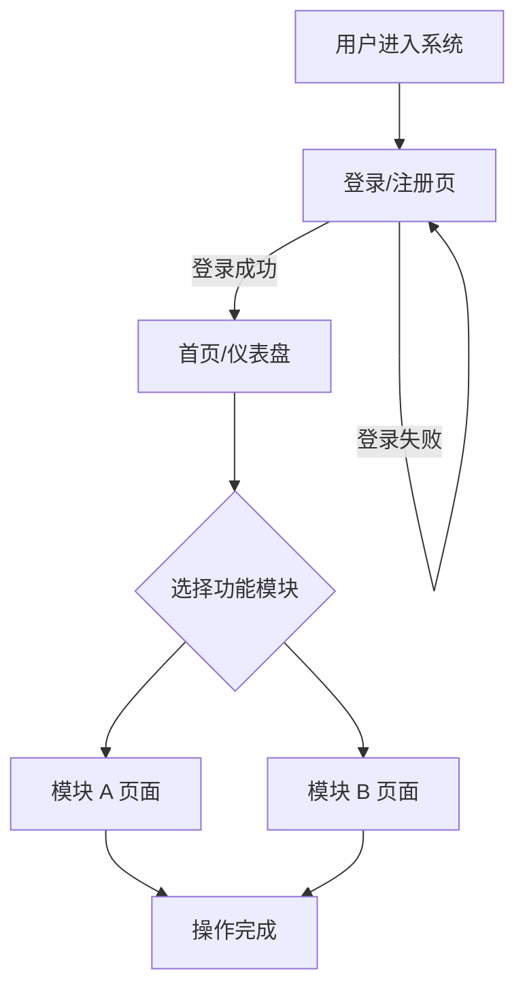
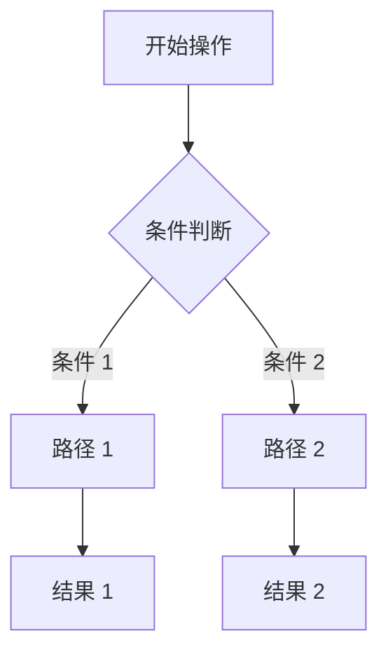

# 交互设计文档

> **文档版本**：1.0
> **创建日期**：{{YYYY-MM-DD}}
> **最后更新**：{{YYYY-MM-DD}}
> **需求来源**：`specs/产品需求文档.md`、`specs/信息架构图.md`、`specs/数据模型字段约定.md`

---

## 1. 交互设计概述

<!-- 用 2-3 句话概括本交互设计的核心目标和设计原则 -->

### 1.1 设计原则

<!-- 列出本项目的交互设计核心原则，如：一致性、即时反馈、容错性等 -->

1. {{原则 1}}：{{说明}}
2. {{原则 2}}：{{说明}}

### 1.2 交互规范总览

<!-- 概述全局交互模式，如：导航方式、反馈形式、操作确认机制等 -->

| 交互维度 | 规范说明 |
|---------|---------|
| 导航模式 | {{如：顶部导航 + 侧边栏}} |
| 操作反馈 | {{如：Toast 提示 / 全局 Loading}} |
| 确认机制 | {{如：危险操作需二次确认}} |
| 返回机制 | {{如：面包屑导航 + 浏览器返回}} |

---

## 2. 页面流转图

<!-- 使用 Mermaid 流程图描述用户操作的完整路径，覆盖主流程和关键分支 -->

### 2.1 主流程



### 2.2 关键分支流程

<!-- 针对复杂操作路径，补充详细的分支流转 -->



---

## 3. 全局状态说明

<!-- 定义所有页面通用的状态类型，确保交互一致性 -->

| 状态类型 | 视觉表现 | 触发条件 | 处理方式 |
|---------|---------|---------|---------|
| **空态** | {{如：居中插图 + 引导文案 + 操作按钮}} | 数据列表为空、搜索无结果 | 提供引导文案和快捷操作入口 |
| **加载态** | {{如：骨架屏 / 局部 Spinner / 全局 Loading 遮罩}} | 接口请求中、数据初始化中 | 禁止重复提交，展示加载动画 |
| **错误态** | {{如：错误插图 + 错误文案 + 重试按钮}} | 接口请求失败、数据异常 | 展示友好错误信息，提供重试操作 |
| **成功态** | {{如：成功图标 + 提示文案 + 自动跳转}} | 操作成功完成 | 展示成功反馈，按需自动跳转 |
| **禁用态** | {{如：灰色样式 + 禁用光标 + Tooltip 说明}} | 权限不足、条件不满足 | 展示禁用原因，引导用户完成前置条件 |

---

## 4. 各页面交互详述

<!-- 按页面分组，描述每个页面的交互细节 -->

### 4.1 {{页面名}}

#### 4.1.1 页面概述

<!-- 页面的核心功能和定位 -->

#### 4.1.2 页面布局

<!-- 描述页面的区域划分、组件排列和视觉优先级，确保前端开发者可直接据此编码 -->

**布局结构**（桌面端）：

```text
┌─────────────────────────────────────────────┐
│ {{区域名称：如 顶部导航栏}}                    │
├──────────┬──────────────────────────────────┤
│ {{左侧}}  │ {{主内容区}}                       │
│ {{侧边栏}} │ ┌──────────┬──────────────────┐ │
│          │ │ {{组件 A}} │ {{组件 B}}        │ │
│          │ ├──────────┴──────────────────┤ │
│          │ │ {{组件 C / 列表 / 表格等}}     │ │
│          │ └─────────────────────────────┘ │
├──────────┴──────────────────────────────────┤
│ {{底部区域：如 分页器 / 操作栏}}               │
└─────────────────────────────────────────────┘
```

**布局结构**（移动端）：

```text
┌─────────────────┐
│ {{顶部导航栏}}     │
├─────────────────┤
│ {{主内容区}}       │
│ ┌─────────────┐ │
│ │ {{组件 A}}    │ │
│ ├─────────────┤ │
│ │ {{组件 B}}    │ │
│ ├─────────────┤ │
│ │ {{组件 C}}    │ │
│ └─────────────┘ │
├─────────────────┤
│ {{底部操作栏}}     │
└─────────────────┘
```

| 区域 | 包含组件 | 视觉优先级 | 说明 |
|------|---------|-----------|------|
| {{区域 1}} | {{组件列表}} | {{高/中/低}} | {{布局方式：如 flex/grid、对齐方式}} |
| {{区域 2}} | {{组件列表}} | {{高/中/低}} | {{布局方式}} |

#### 4.1.3 主要操作

| 操作名称 | 操作入口 | 操作流程 | 预期反馈 |
|---------|---------|---------|---------|
| {{操作 1}} | {{按钮位置/链接位置}} | {{步骤描述}} | {{反馈形式和内容}} |
| {{操作 2}} | {{按钮位置/链接位置}} | {{步骤描述}} | {{反馈形式和内容}} |

#### 4.1.4 状态切换

<!-- 描述该页面的状态流转 -->

| 当前状态 | 触发事件 | 目标状态 | 过渡效果 |
|---------|---------|---------|---------|
| {{状态 A}} | {{触发事件}} | {{状态 B}} | {{过渡动画描述}} |

#### 4.1.5 反馈方式

| 反馈类型 | 触发条件 | 反馈内容 | 展示位置 | 持续时间 |
|---------|---------|---------|---------|---------|
| Toast | {{触发条件}} | {{提示文案}} | {{页面位置}} | {{如：3 秒自动消失}} |
| Modal | {{触发条件}} | {{弹窗内容}} | {{居中弹窗}} | {{如：需用户手动关闭}} |

<!-- 重复以上结构定义每个页面 -->

---

## 5. 异常场景处理

<!-- 定义所有异常场景的处理方式，确保用户体验的容错性 -->

| 异常类型 | 触发条件 | 用户提示 | 恢复方式 | 备注 |
|---------|---------|---------|---------|------|
| 网络异常 | 网络断开、请求超时 | "网络连接异常，请检查网络后重试" | 提供"重试"按钮 | 区分超时和断网 |
| 数据为空 | 列表无数据、搜索无结果 | "暂无数据" + 引导文案 | 提供创建/搜索入口 | 配合空态插图 |
| 权限不足 | 用户无权访问页面或操作 | "您没有权限执行此操作" | 引导联系管理员或升级权限 | 不暴露具体权限配置 |
| 服务端错误 | 500 系统错误 | "服务器开小差了，请稍后重试" | 提供"重试"按钮 | 不展示技术错误信息 |
| 参数错误 | 请求参数不合法 | "请求参数有误，请刷新重试" | 自动刷新或提供刷新按钮 | 通常为前端 Bug |
| 登录过期 | Token 过期或无效 | "登录已过期，请重新登录" | 跳转登录页 | 保存当前页面路径以便登录后回跳 |
| 并发冲突 | 多人同时编辑同一资源 | "数据已被他人修改，请刷新后重试" | 提供"刷新"按钮，展示最新数据 | 乐观锁冲突 |

---

## 6. 表单验证规则

<!-- 定义所有表单的验证规则，区分实时校验和提交校验 -->

### 6.1 {{表单名称}}

| 字段名 | 字段类型 | 必填 | 校验时机 | 校验规则 | 错误提示 |
|--------|---------|------|---------|---------|---------|
| {{字段名}} | {{文本/数字/邮箱/手机号等}} | 是/否 | {{实时/提交/两者}} | {{如：6-20 位，含字母和数字}} | {{如：密码长度为 6-20 位}} |
| {{字段名}} | {{类型}} | 是/否 | {{时机}} | {{规则}} | {{提示}} |

### 6.2 校验策略说明

<!-- 描述全局校验策略 -->

- **实时校验**：{{如：输入框失焦时触发校验，校验通过后不再重复校验}}
- **提交校验**：{{如：点击提交按钮时，对全部字段进行校验，定位到第一个错误字段}}
- **异步校验**：{{如：用户名唯一性校验，输入停止 500ms 后触发接口校验}}

<!-- 重复以上结构定义每个表单 -->

---

## 7. 动效说明

<!-- 仅当涉及复杂动画时填写本章节。如果没有动效需求，填写"本项目无特殊动效需求"即可。 -->

### 7.1 全局动效规范

| 动效类型 | 持续时间 | 缓动曲线 | 使用场景 |
|---------|---------|---------|---------|
| 页面切换 | {{如：300ms}} | {{如：ease-in-out}} | {{路由切换}} |
| 元素出现 | {{如：200ms}} | {{如：ease-out}} | {{列表加载、弹窗出现}} |
| 元素消失 | {{如：150ms}} | {{如：ease-in}} | {{列表删除、弹窗关闭}} |

### 7.2 复杂动效详述

| 动画名称 | 触发条件 | 时序描述 | 持续时间 | 缓动曲线 | 备注 |
|---------|---------|---------|---------|---------|------|
| {{动画名称}} | {{触发条件}} | {{分步骤描述动画时序}} | {{总时长}} | {{缓动函数}} | {{如：需降级处理}} |

---

## 8. 变更记录

| 日期 | 版本 | 变更内容 | 作者 |
|------|------|---------|------|
| {{YYYY-MM-DD}} | 1.0 | 初始版本 | {{作者}} |
